# VLM Object Recognition System - Architecture Diagrams

This document contains comprehensive Mermaid diagrams that visualize the architecture and structure of the VLM Object Recognition System.

## 📊 System Architecture Overview


## 🔄 System Flow Architecture

```mermaid
flowchart TB
    subgraph "User Interface Layer"
        UI[User Input]
        VOICE[🎤 Voice Input]
        TEXT[⌨️ Text Input]
    end

    subgraph "Input Processing Layer"
        SPEECH[Speech Recognition]
        LANG[Language Detection]
        TRANS[Translation Engine]
        EXTRACT[Object Extraction]
    end

    subgraph "VLM Processing Layer"
        VLM_SEL{VLM Selection}
        GROK[☁️ Grok-4 API]
        QWEN[☁️ Qwen-VL API]
        LLAVA[🖥️ LLaVA Local]
    end

    subgraph "Image Processing Layer"
        IMG_PROC[Image Processor]
        COORD_PARSE[Coordinate Parser]
        ANNOTATE[Image Annotator]
    end

    subgraph "Output Layer"
        RESPONSE[Response Generator]
        TTS[🔊 Text-to-Speech]
        DISPLAY[📱 Visual Display]
    end

    subgraph "Configuration Layer"
        CONFIG[Settings Manager]
        API_KEYS[API Key Manager]
    end

    UI --> VOICE
    UI --> TEXT
    VOICE --> SPEECH
    TEXT --> LANG
    SPEECH --> LANG
    LANG --> TRANS
    TRANS --> EXTRACT
    LANG --> EXTRACT
    EXTRACT --> VLM_SEL

    VLM_SEL --> GROK
    VLM_SEL --> QWEN
    VLM_SEL --> LLAVA

    GROK --> COORD_PARSE
    QWEN --> COORD_PARSE
    LLAVA --> COORD_PARSE

    COORD_PARSE --> IMG_PROC
    IMG_PROC --> ANNOTATE
    COORD_PARSE --> RESPONSE
    ANNOTATE --> DISPLAY
    RESPONSE --> TTS
    RESPONSE --> DISPLAY

    CONFIG --> VLM_SEL
    API_KEYS --> GROK
    API_KEYS --> QWEN

    classDef input fill:#e3f2fd,stroke:#1976d2,stroke-width:2px
    classDef processing fill:#f3e5f5,stroke:#7b1fa2,stroke-width:2px
    classDef vlm fill:#fff3e0,stroke:#f57c00,stroke-width:2px
    classDef image fill:#e8f5e8,stroke:#388e3c,stroke-width:2px
    classDef output fill:#fce4ec,stroke:#c2185b,stroke-width:2px
    classDef config fill:#f9fbe7,stroke:#689f38,stroke-width:2px

    class UI,VOICE,TEXT input
    class SPEECH,LANG,TRANS,EXTRACT processing
    class VLM_SEL,GROK,QWEN,LLAVA vlm
    class IMG_PROC,COORD_PARSE,ANNOTATE image
    class RESPONSE,TTS,DISPLAY output
    class CONFIG,API_KEYS config
```



## 🏗️ Modular System Architecture

```mermaid
flowchart LR
    subgraph "vlm_modular/"
        MAIN[main.py<br/>🚀 Entry Point]
        
        subgraph "config/"
            SETTINGS[settings.py<br/>⚙️ System Config]
            KEYS[api_keys.py<br/>🔑 API Management]
        end
        
        subgraph "input/"
            VOICE_H[voice_handler.py<br/>🎤 Speech Processing]
            TEXT_P[text_processor.py<br/>📝 Text Processing]
        end
        
        subgraph "vlm/"
            FACTORY[factory.py<br/>🏭 VLM Factory]
            BASE[base.py<br/>🔧 Base Interface]
            GROK_C[grok_client.py<br/>☁️ Grok Client]
            QWEN_C[qwen_client_openai.py<br/>☁️ Qwen Client]
            LLAVA_C[llava_client.py<br/>🖥️ LLaVA Client]
        end
        
        subgraph "image/"
            PROCESSOR[processor.py<br/>🖼️ Image Processing]
            ANNOTATOR[annotator.py<br/>✏️ Image Annotation]
            COORD_PARSER[coordinate_parser.py<br/>📍 Coordinate Parsing]
        end
        
        subgraph "output/"
            RESP_GEN[response_generator.py<br/>💬 Response Generation]
            TTS_H[tts_handler.py<br/>🔊 Text-to-Speech]
        end
        
        subgraph "utils/"
            UTILS[__init__.py<br/>🛠️ Utilities]
        end
    end

    MAIN --> SETTINGS
    MAIN --> KEYS
    MAIN --> VOICE_H
    MAIN --> TEXT_P
    MAIN --> FACTORY
    MAIN --> PROCESSOR
    MAIN --> ANNOTATOR
    MAIN --> COORD_PARSER
    MAIN --> RESP_GEN
    MAIN --> TTS_H

    FACTORY --> BASE
    FACTORY --> GROK_C
    FACTORY --> QWEN_C
    FACTORY --> LLAVA_C
    FACTORY --> KEYS
    FACTORY --> SETTINGS

    VOICE_H --> SETTINGS
    TEXT_P --> SETTINGS
    PROCESSOR --> SETTINGS
    ANNOTATOR --> SETTINGS
    RESP_GEN --> SETTINGS
    TTS_H --> SETTINGS

    classDef main fill:#ff6b6b,stroke:#d63031,stroke-width:3px,color:#fff
    classDef config fill:#fdcb6e,stroke:#e17055,stroke-width:2px
    classDef input fill:#6c5ce7,stroke:#5f3dc4,stroke-width:2px,color:#fff
    classDef vlm fill:#a29bfe,stroke:#6c5ce7,stroke-width:2px
    classDef image fill:#fd79a8,stroke:#e84393,stroke-width:2px
    classDef output fill:#00b894,stroke:#00a085,stroke-width:2px,color:#fff
    classDef utils fill:#636e72,stroke:#2d3436,stroke-width:2px,color:#fff

    class MAIN main
    class SETTINGS,KEYS config
    class VOICE_H,TEXT_P input
    class FACTORY,BASE,GROK_C,QWEN_C,LLAVA_C vlm
    class PROCESSOR,ANNOTATOR,COORD_PARSER image
    class RESP_GEN,TTS_H output
    class UTILS utils
```



## 🧪 Testing Framework Architecture

```mermaid
flowchart TB
    subgraph "testing/"
        MAIN_TEST[test_system.py<br/>🧪 Main Test Suite]
        
        subgraph "Comparison Tests"
            COMP_VLM[compare_vlm_outputs.py<br/>🔄 VLM Output Comparison]
            COMP_GROK[compare_grok_outputs.py<br/>🔄 Grok Specific Tests]
            COMP_API[compare_grok_api.py<br/>🔄 API Level Tests]
        end
        
        subgraph "Verification Tests"
            VERIFY_GROK[verify_grok_implementation.py<br/>✅ Grok Verification]
            VERIFY_MOD[test_modular_grok.py<br/>✅ Modular Tests]
        end
        
        subgraph "Test Results"
            VLM_RESULTS[vlm_comparison_results.json<br/>📊 VLM Results]
            GROK_RESULTS[grok_verification_results.json<br/>📊 Grok Results]
            API_RESULTS[grok_api_comparison.json<br/>📊 API Results]
        end
        
        TEST_README[README.md<br/>📚 Testing Documentation]
    end

    subgraph "Source Systems"
        ORIGINAL[../imageRecogVLM.py<br/>📜 Original Implementation]
        MODULAR[../vlm_modular/<br/>🏗️ Modular System]
    end

    MAIN_TEST --> COMP_VLM
    MAIN_TEST --> COMP_GROK
    MAIN_TEST --> VERIFY_GROK

    COMP_VLM --> ORIGINAL
    COMP_VLM --> MODULAR
    COMP_VLM --> VLM_RESULTS

    COMP_GROK --> ORIGINAL
    COMP_GROK --> MODULAR
    COMP_GROK --> GROK_RESULTS

    COMP_API --> ORIGINAL
    COMP_API --> API_RESULTS

    VERIFY_GROK --> MODULAR
    VERIFY_GROK --> GROK_RESULTS

    VERIFY_MOD --> MODULAR

    classDef test fill:#74b9ff,stroke:#0984e3,stroke-width:2px
    classDef comparison fill:#a29bfe,stroke:#6c5ce7,stroke-width:2px
    classDef verification fill:#00b894,stroke:#00a085,stroke-width:2px
    classDef results fill:#fdcb6e,stroke:#e17055,stroke-width:2px
    classDef source fill:#fd79a8,stroke:#e84393,stroke-width:2px
    classDef docs fill:#55a3ff,stroke:#2980b9,stroke-width:2px

    class MAIN_TEST test
    class COMP_VLM,COMP_GROK,COMP_API comparison
    class VERIFY_GROK,VERIFY_MOD verification
    class VLM_RESULTS,GROK_RESULTS,API_RESULTS results
    class ORIGINAL,MODULAR source
    class TEST_README docs
```



## 📁 Complete Project Structure


## 🔄 VLM Provider Integration Flow


## 📈 Development Evolution

```mermaid
gitgraph
    commit id: "Initial Monolithic System"
    commit id: "Basic VLM Integration"
    commit id: "Voice Input Added"
    
    branch modular-architecture
    commit id: "Modular Architecture Setup"
    commit id: "Config Module"
    commit id: "Input Module"
    commit id: "VLM Module & Factory"
    commit id: "Image Processing Module"
    commit id: "Output Module"
    
    branch testing-framework
    commit id: "Comparison Tests"
    commit id: "Verification Scripts"
    commit id: "Unit Tests"
    commit id: "Test Results Tracking"
    merge modular-architecture
    
    branch documentation
    commit id: "README Updates"
    commit id: "Project Summary"
    commit id: "Development Statistics"
    commit id: "Architecture Diagrams"
    merge modular-architecture
    
    commit id: "Production Ready Release" type: HIGHLIGHT
```

---

## 🛠️ How to Use These Diagrams

1. **VS Code with Mermaid Extension**: Copy any diagram code block and paste it into a `.md` file
2. **Mermaid Live Editor**: Visit [mermaid.live](https://mermaid.live) and paste the code
3. **GitHub/GitLab**: These diagrams will render automatically in markdown files
4. **Documentation**: Include these in your project documentation for visual clarity

The diagrams accurately reflect your current project structure and can be updated as the system evolves!
