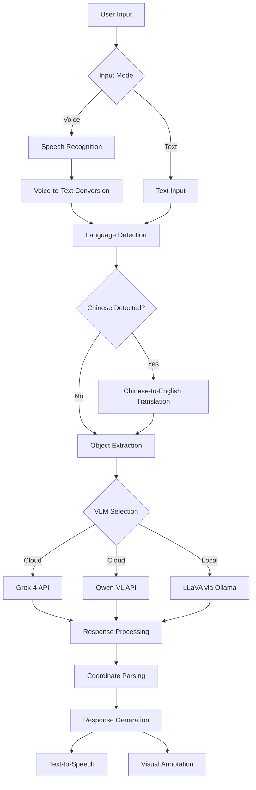

# VLM Object Recognition System (Voice + Multi-Mode)

🤖 A comprehensive Vision Language Model (VLM) system that combines **voice input**, **text input**, and **multiple VLM processing pathways** for intelligent object recognition and localization.

## 🌟 Features

### 🎤 Input Modes
- **Voice Input**: Speak your commands naturally in English or Chinese
- **Text Input**: Traditional keyboard input with multilingual support
- **Automatic Fallback**: Voice input falls back to text if recognition fails

### 🤖 VLM Processing Options
- **Cloud VLM (Grok-4)**: High accuracy via X.AI API
- **Cloud VLM (Qwen-VL)**: Excellent Chinese support via DashScope API  
- **Local VLM (LLaVA)**: Privacy-focused processing via Ollama

### 🌐 Multilingual Support
- **English Commands**: "please grab the apple to me", "find the phone"
- **Chinese Commands**: "请帮我拿苹果", "找手机给我"
- **Mixed Language**: "给请帮我拿雪碧, i mean bring me sprite"
- **Auto-Translation**: Chinese inputs automatically translated to English

### 🎯 Object Recognition & Localization
- Precise coordinate detection with center-point accuracy
- Multiple object instance support
- Visual annotation with star markers
- Coordinate scaling for different image resolutions

### 🔊 Audio Feedback
- Text-to-speech responses using macOS built-in `say` command
- Concise audio summaries ("Object found" vs "Object not found")
- No internet required for TTS

## 🚀 Quick Start

### Prerequisites

```bash
# Install Python dependencies
pip install SpeechRecognition pyaudio pillow gtts pygame requests openai

# For macOS users (if pyaudio installation fails)
brew install portaudio
pip install pyaudio

# For local VLM support (optional)
curl -fsSL https://ollama.com/install.sh | sh
ollama pull llava:latest
ollama serve
```

### Environment Setup

```bash
# Set API keys (choose based on your preferred VLM)
export XAI_API_KEY="your_xai_api_key_here"          # For Grok-4
export DASHSCOPE_API_KEY="your_dashscope_key_here"  # For Qwen-VL
```

### Basic Usage

```bash
python imageRecogVLM.py
```

## 📖 Usage Examples

### Voice Input Examples

**English Voice Commands:**
- "Please grab the apple to me"
- "Find me the phone"
- "Show me the bottle"
- "Locate the keys"

**Chinese Voice Commands:**
- "请帮我拿苹果" (Please help me get the apple)
- "找手机给我" (Find the phone for me)
- "给我拿可乐" (Get me the coke)

### Text Input Examples

**English Text:**
```
💬 Enter your command: please grab the apple to me
💬 Enter your command: find the phone
```

**Chinese Text:**
```
💬 Enter your command: 请帮我拿苹果
💬 Enter你的命令: 找手机给我
```

## 🏗️ System Architecture



## 🔧 Configuration

### Voice Input Settings
- **Timeout**: 10 seconds for speech detection
- **Phrase Limit**: 8 seconds maximum recording
- **Languages**: English (en-US), Chinese (zh-CN)
- **Fallback**: Offline recognition via CMU Sphinx

### VLM Processing Options
- **Grok-4**: Requires XAI_API_KEY, highest accuracy
- **Qwen-VL**: Requires DASHSCOPE_API_KEY, excellent for Chinese
- **LLaVA Local**: Requires Ollama + LLaVA model, privacy-focused

### Image Processing
- **Resolution**: Uses original image resolution by default
- **Format**: JPEG with 95% quality for original resolution
- **Annotation**: Yellow star with red outline for detected objects

## 📁 Project Structure

```
vlmTry/
├── imageRecogVLM.py          # Main application
├── sampleImages/             # Test images directory
│   └── image_000777_rsz.jpg  # Sample image
├── README.md                 # English documentation
├── README_CN.md              # Chinese documentation
└── system_arch.mmd           # System architecture diagram
```

## 🛠️ API Integration

### Grok-4 (X.AI)
```python
# High accuracy cloud processing
headers = {"Authorization": f"Bearer {XAI_API_KEY}"}
url = "https://api.x.ai/v1/chat/completions"
```

### Qwen-VL (DashScope)
```python
# Excellent Chinese support
client = OpenAI(
    api_key=DASHSCOPE_API_KEY,
    base_url="https://dashscope.aliyuncs.com/compatible-mode/v1"
)
```

### LLaVA (Local)
```python
# Privacy-focused local processing
url = "http://localhost:11434/api/generate"
```

## 🔊 Voice Input Technical Details

### Speech Recognition Pipeline
1. **Microphone Calibration**: Auto-adjusts for ambient noise
2. **Multi-language Detection**: Tries English first, then Chinese
3. **Offline Fallback**: Uses CMU Sphinx if internet unavailable
4. **Error Handling**: Graceful fallback to text input

### Supported Voice Commands
- **Grab Pattern**: "grab the [object] to me"
- **Find Pattern**: "find me the [object]"
- **Show Pattern**: "show me the [object]"
- **Locate Pattern**: "locate the [object]"

## 🌍 Multilingual Support

### Chinese Translation Patterns
```python
chinese_patterns = {
    r'请.*?拿.*?给我': 'please grab {} to me',
    r'帮我.*?拿.*': 'help me get {}',
    r'找.*?给我': 'find {} for me',
    # Object translations
    r'苹果': 'apple',
    r'手机|电话': 'phone',
    r'可乐': 'coke',
    r'雪碧': 'sprite'
}
```

## 📊 Response Format

### Console Output
```
🤖 VLM Object Recognition System (Voice + 3-Mode)
🎤 Input Mode Selection
💬 Command received: 'find the phone'
🎯 Target object identified: 'phone'
🚀 Calling Grok-4 Vision API (Cloud)...
📊 COORDINATE SUMMARY TABLE:
| Object ID | H (Horizontal) | V (Vertical) |
|-----------|----------------|--------------|
|     1     |      320       |     240      |
```

### Audio Output
- **Success**: "Phone found"
- **Failure**: "Object not found"

## 🚀 Performance

### Processing Times (Typical)
- **Voice Recognition**: 2-5 seconds
- **Grok-4 API**: 3-8 seconds
- **Qwen-VL API**: 2-6 seconds
- **Local LLaVA**: 5-15 seconds (depending on hardware)

### Accuracy Comparison
- **Grok-4**: Highest accuracy, best for complex scenes
- **Qwen-VL**: Excellent for Chinese objects/text
- **LLaVA Local**: Good accuracy, privacy-focused

## 🔍 Troubleshooting

### Voice Input Issues
```bash
# Check microphone permissions
# macOS: System Preferences > Security & Privacy > Microphone

# Install/reinstall audio dependencies
brew install portaudio
pip install --upgrade pyaudio SpeechRecognition
```

### API Issues
```bash
# Verify API keys
echo $XAI_API_KEY
echo $DASHSCOPE_API_KEY

# Test network connectivity
curl -I https://api.x.ai
curl -I https://dashscope.aliyuncs.com
```

### Local VLM Issues
```bash
# Check Ollama status
ollama list
ollama ps

# Restart Ollama service
ollama serve

# Pull LLaVA model if missing
ollama pull llava:latest
```

## 🤝 Contributing

1. Fork the repository
2. Create your feature branch (`git checkout -b feature/amazing-feature`)
3. Commit your changes (`git commit -m 'Add amazing feature'`)
4. Push to the branch (`git push origin feature/amazing-feature`)
5. Open a Pull Request

## 📄 License

This project is licensed under the MIT License - see the [LICENSE](LICENSE) file for details.

## 🙏 Acknowledgments

- **OpenAI** for GPT models and API standards
- **X.AI** for Grok-4 Vision API
- **Alibaba** for Qwen-VL and DashScope API
- **Ollama** for local LLM infrastructure
- **LLaVA** for open-source vision language model
- **Google** for Speech Recognition API
- **CMU Sphinx** for offline speech recognition