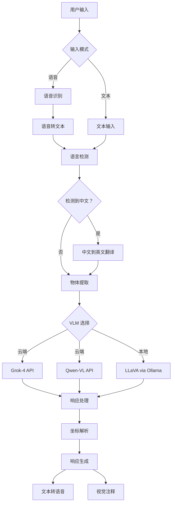

# VLM 物体识别系统（语音 + 多模式）

🤖 一个综合性的视觉语言模型（VLM）系统，结合了**语音输入**、**文本输入**和**多种VLM处理路径**，实现智能物体识别和定位。

## 🌟 功能特性

### 🎤 输入模式
- **语音输入**：用中文或英文自然地说出您的指令
- **文本输入**：传统键盘输入，支持多语言
- **自动回退**：语音识别失败时自动回退到文本输入

### 🤖 VLM 处理选项
- **云端VLM (Grok-4)**：通过 X.AI API 实现高精度识别
- **云端VLM (Qwen-VL)**：通过 DashScope API 提供优秀的中文支持
- **本地VLM (LLaVA)**：通过 Ollama 实现隐私保护的本地处理

### 🌐 多语言支持
- **英文指令**："please grab the apple to me"、"find the phone"
- **中文指令**："请帮我拿苹果"、"找手机给我"
- **混合语言**："给请帮我拿雪碧, i mean bring me sprite"
- **自动翻译**：中文输入自动翻译为英文

### 🎯 物体识别与定位
- 精确的坐标检测，具有中心点精度
- 支持多个物体实例
- 使用星形标记进行视觉注释
- 针对不同图像分辨率的坐标缩放

### 🔊 音频反馈
- 使用 macOS 内置 `say` 命令进行文本转语音
- 简洁的音频摘要（"找到物体" vs "未找到物体"）
- TTS 无需互联网连接

## 🚀 快速开始

### 前置要求

```bash
# 安装 Python 依赖
pip install SpeechRecognition pyaudio pillow gtts pygame requests openai

# macOS 用户（如果 pyaudio 安装失败）
brew install portaudio
pip install pyaudio

# 本地 VLM 支持（可选）
curl -fsSL https://ollama.com/install.sh | sh
ollama pull llava:latest
ollama serve
```

### 环境设置

```bash
# 设置 API 密钥（根据您偏好的 VLM 选择）
export XAI_API_KEY="your_xai_api_key_here"          # 用于 Grok-4
export DASHSCOPE_API_KEY="your_dashscope_key_here"  # 用于 Qwen-VL
```

### 基本用法

```bash
python imageRecogVLM.py
```

## 📖 使用示例

### 语音输入示例

**中文语音指令：**
- "请帮我拿苹果"
- "找手机给我"
- "给我拿可乐"
- "帮我找钥匙"

**英文语音指令：**
- "Please grab the apple to me"
- "Find me the phone"
- "Show me the bottle"
- "Locate the keys"

### 文本输入示例

**中文文本：**
```
💬 输入您的指令：请帮我拿苹果
💬 输入您的指令：找手机给我
```

**英文文本：**
```
💬 Enter your command: please grab the apple to me
💬 Enter your command: find the phone
```

## 🏗️ 系统架构



## 🔧 配置

### 语音输入设置
- **超时时间**：语音检测 10 秒
- **短语限制**：最大录音 8 秒
- **语言**：英语 (en-US)、中文 (zh-CN)
- **回退**：通过 CMU Sphinx 进行离线识别

### VLM 处理选项
- **Grok-4**：需要 XAI_API_KEY，最高精度
- **Qwen-VL**：需要 DASHSCOPE_API_KEY，中文支持优秀
- **LLaVA 本地**：需要 Ollama + LLaVA 模型，注重隐私

### 图像处理
- **分辨率**：默认使用原始图像分辨率
- **格式**：原始分辨率下的 JPEG，95% 质量
- **注释**：检测到的物体使用黄色星形和红色轮廓

## 📁 项目结构

```
vlmTry/
├── imageRecogVLM.py          # 主应用程序
├── sampleImages/             # 测试图像目录
│   └── image_000777_rsz.jpg  # 示例图像
├── README.md                 # 英文文档
├── README_CN.md              # 中文文档
└── system_arch.mmd           # 系统架构图
```

## 🛠️ API 集成

### Grok-4 (X.AI)
```python
# 高精度云端处理
headers = {"Authorization": f"Bearer {XAI_API_KEY}"}
url = "https://api.x.ai/v1/chat/completions"
```

### Qwen-VL (DashScope)
```python
# 优秀的中文支持
client = OpenAI(
    api_key=DASHSCOPE_API_KEY,
    base_url="https://dashscope.aliyuncs.com/compatible-mode/v1"
)
```

### LLaVA (本地)
```python
# 注重隐私的本地处理
url = "http://localhost:11434/api/generate"
```

## 🔊 语音输入技术细节

### 语音识别流水线
1. **麦克风校准**：自动调节环境噪音
2. **多语言检测**：先尝试英语，然后中文
3. **离线回退**：如果无互联网则使用 CMU Sphinx
4. **错误处理**：优雅地回退到文本输入

### 支持的语音指令
- **拿取模式**："帮我拿[物体]"
- **查找模式**："找[物体]给我"
- **显示模式**："给我看[物体]"
- **定位模式**："找到[物体]"

## 🌍 多语言支持

### 中文翻译模式
```python
chinese_patterns = {
    r'请.*?拿.*?给我': 'please grab {} to me',
    r'帮我.*?拿.*': 'help me get {}',
    r'找.*?给我': 'find {} for me',
    # 物体翻译
    r'苹果': 'apple',
    r'手机|电话': 'phone',
    r'可乐': 'coke',
    r'雪碧': 'sprite'
}
```

## 📊 响应格式

### 控制台输出
```
🤖 VLM 物体识别系统（语音 + 多模式）
🎤 输入模式选择
💬 收到指令：'找手机'
🎯 识别目标物体：'手机'
🚀 调用 Grok-4 视觉 API（云端）...
📊 坐标摘要表：
| 物体ID | H (水平) | V (垂直) |
|--------|----------|----------|
|   1    |   320    |   240    |
```

### 音频输出
- **成功**："找到手机"
- **失败**："未找到物体"

## 🚀 性能

### 处理时间（典型）
- **语音识别**：2-5 秒
- **Grok-4 API**：3-8 秒
- **Qwen-VL API**：2-6 秒
- **本地 LLaVA**：5-15 秒（取决于硬件）

### 精度比较
- **Grok-4**：最高精度，适合复杂场景
- **Qwen-VL**：中文物体/文本识别优秀
- **LLaVA 本地**：良好精度，注重隐私

## 🔍 故障排除

### 语音输入问题
```bash
# 检查麦克风权限
# macOS：系统偏好设置 > 安全性与隐私 > 麦克风

# 安装/重新安装音频依赖
brew install portaudio
pip install --upgrade pyaudio SpeechRecognition
```

### API 问题
```bash
# 验证 API 密钥
echo $XAI_API_KEY
echo $DASHSCOPE_API_KEY

# 测试网络连接
curl -I https://api.x.ai
curl -I https://dashscope.aliyuncs.com
```

### 本地 VLM 问题
```bash
# 检查 Ollama 状态
ollama list
ollama ps

# 重启 Ollama 服务
ollama serve

# 如果缺少 LLaVA 模型则拉取
ollama pull llava:latest
```

## 🤝 贡献

1. Fork 此仓库
2. 创建您的功能分支（`git checkout -b feature/amazing-feature`）
3. 提交您的更改（`git commit -m 'Add amazing feature'`）
4. 推送到分支（`git push origin feature/amazing-feature`）
5. 打开 Pull Request

## 📄 许可证

此项目采用 MIT 许可证 - 详见 [LICENSE](LICENSE) 文件。

## 🙏 致谢

- **OpenAI** 提供 GPT 模型和 API 标准
- **X.AI** 提供 Grok-4 视觉 API
- **阿里巴巴** 提供 Qwen-VL 和 DashScope API
- **Ollama** 提供本地 LLM 基础设施
- **LLaVA** 提供开源视觉语言模型
- **Google** 提供语音识别 API
- **CMU Sphinx** 提供离线语音识别
- **Apple** 提供 macOS 内置 TTS 支持
